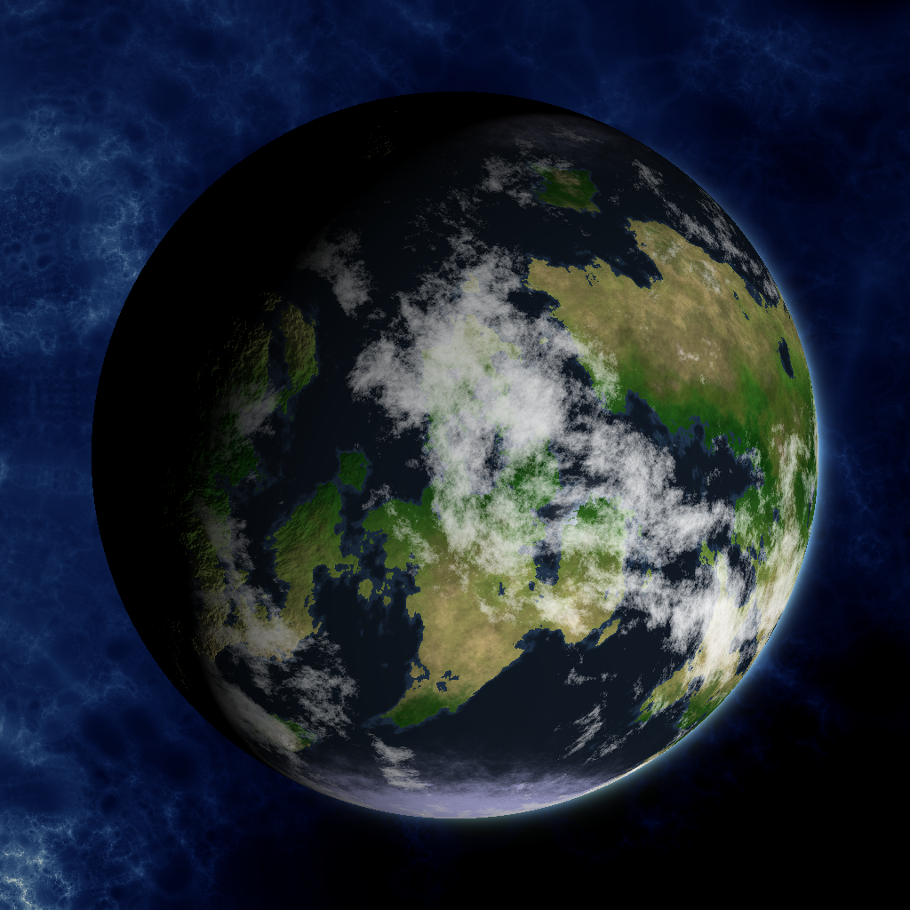
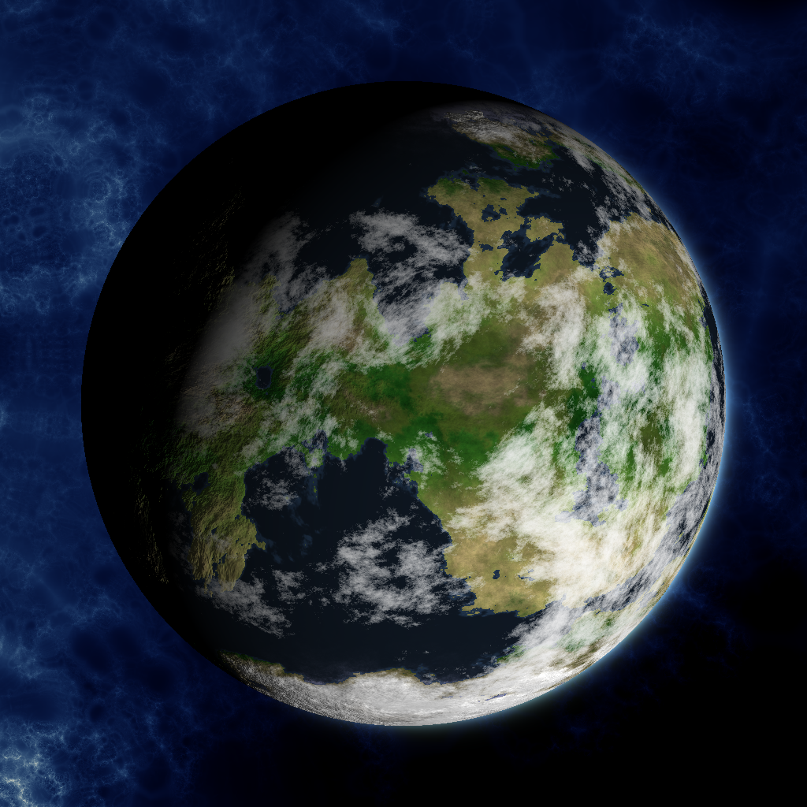
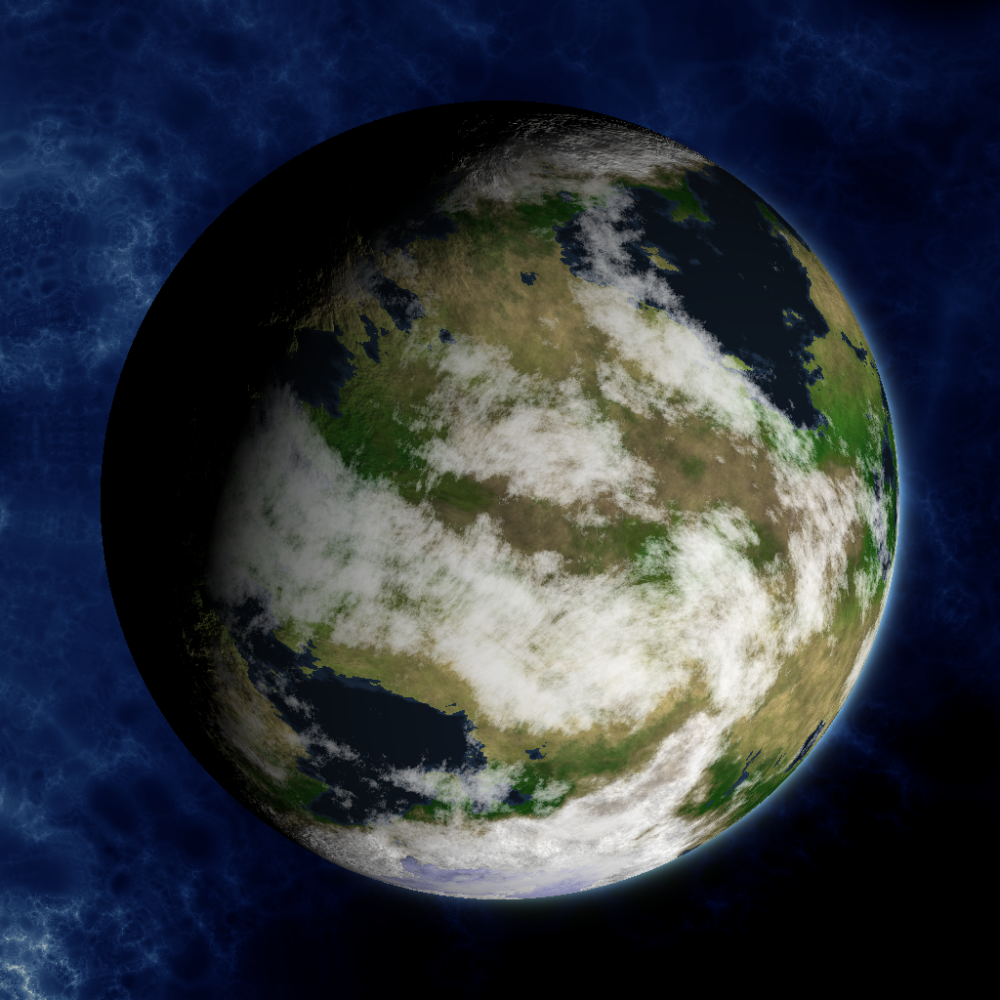
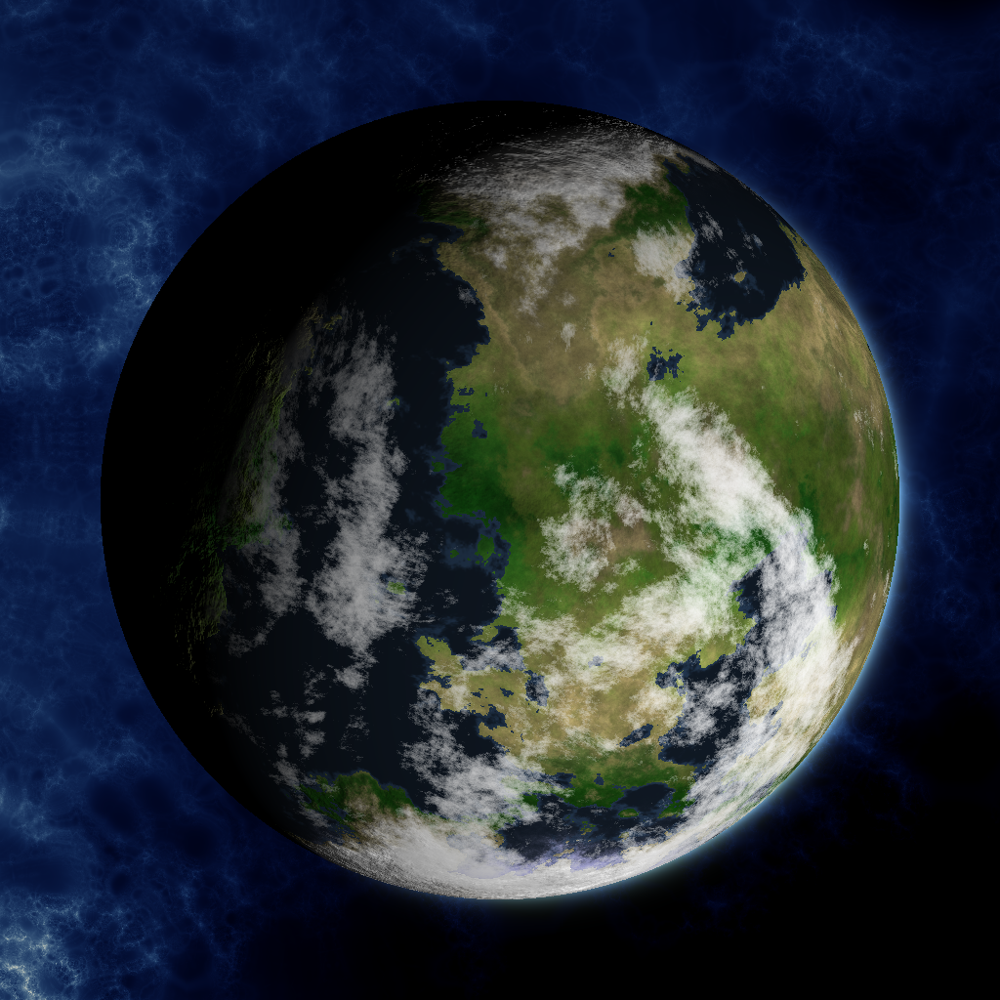

# An Earth-Like procedural planet generator

## Usage

`main.py` will generate 10 of the example globe images.

`main2D.py` will generate a single 2D heightmap, RGB texture, and specular map.

`main_gif.py` will generate a rotation globe animation.  This requires `ffmpeg`.

#### Example 1

#### Example 2

#### Example 3

#### Example 4

### Animation

